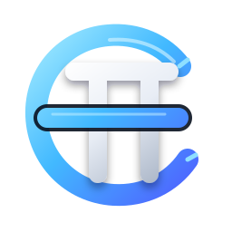
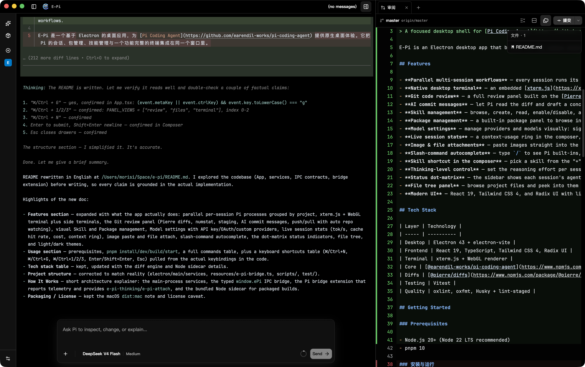

<p align="center">
  
</p>

# E-Pi

> A focused desktop shell for [Pi Coding Agent](https://github.com/earendil-works/pi-coding-agent) sessions, packages, and terminal workflows.

E-Pi is an Electron desktop app that brings the [Pi Coding Agent](https://github.com/earendil-works/pi-coding-agent) into a native desktop experience. It combines Pi sessions, package and skill management, Git workflows, and a full-featured terminal into a single window — so you can drive Pi, review its work, and manage your project without ever leaving the app.



## Features

- **Parallel multi-session workflows** — every session runs its own isolated Pi process. Sessions are grouped by project in the sidebar, run concurrently without interfering with each other, and switch instantly.
- **Native desktop terminal** — an embedded [xterm.js](https://xtermjs.org/) terminal with WebGL rendering shows Pi's own TUI live. Additional side terminals (node-pty) can be spawned side-by-side for shell work next to your agent.
- **Git code review** — a full review panel built on the [Pierre diffs](https://www.npmjs.com/package/@pierre/diffs) engine. See per-file status, line counts (git numstat), stage/unstage changes, generate commit messages with AI, then commit, push, or pull. The repo is watched automatically, so external edits refresh the review in real time.
- **AI commit messages** — let Pi read the diff and draft a concise, conventional commit message for you.
- **Skill management** — browse, create, read, enable/disable, and remove Pi skills from a visual panel. Add external skill directories and see user/project/path scopes at a glance.
- **Package management** — a built-in package panel to browse installed Pi packages, search the npm registry, check for updates, view download stats, and install/update/remove packages (npm or git sources) — no CLI needed.
- **Model settings** — manage providers and models visually: sign in with an API key or OAuth, switch the default model per session, and add custom OpenAI-compatible providers with your own base URL and model definitions.
- **Live session stats** — a context-usage ring in the composer, plus per-session token usage, cache hit rate, output speed (tok/s), and cost. All reported by a bridge extension that runs inside each Pi process.
- **Image & file attachments** — paste images straight into the composer, or attach files from disk; attachments are delivered to Pi with proper mime types via a custom `e-pi-attach` command.
- **Slash-command autocomplete** — type `/` to see Pi built-ins, prompt templates, and your skills with argument hints, just like the TUI.
- **Skill shortcut in the composer** — pick a skill from the "+" menu and send a prompt through it (`/skill:<name>`).
- **Thinking-level control** — set the reasoning effort per session with the `e-pi-thinking` command.
- **Status dot-matrix** — the sidebar shows each session's agent state on a 3×3 dot grid with a Braille spinner, so background work is visible across projects at a glance.
- **File tree panel** — browse project files and peek into them without leaving the app.
- **Modern UI** — React 19, Tailwind CSS 4, and Radix UI with light/dark themes and per-module font sizing.

## Tech Stack

| Layer    | Technology                                                                                                             |
| -------- | ---------------------------------------------------------------------------------------------------------------------- |
| Desktop  | Electron 43 + electron-vite                                                                                            |
| Frontend | React 19, TypeScript, Tailwind CSS 4, Radix UI                                                                         |
| Terminal | xterm.js + WebGL renderer                                                                                              |
| Core     | [@earendil-works/pi-coding-agent](https://www.npmjs.com/package/@earendil-works/pi-coding-agent) (Pi itself), node-pty |
| Diffs    | [@pierre/diffs](https://www.npmjs.com/package/@pierre/diffs)                                                           |
| Testing  | Vitest                                                                                                                 |
| Quality  | oxlint, oxfmt, Husky + lint-staged                                                                                     |

## Installation

E-Pi ships prebuilt installers for both platforms from the [Releases](https://github.com/JustGenius-s/e-pi/releases) page — no Node.js or pnpm required.

### macOS

1. Download `E-Pi-<version>-arm64.dmg` (Apple Silicon) or `E-Pi-<version>-x64.dmg` (Intel) from Releases.
2. Open the DMG and drag **E-Pi** into your Applications folder.
3. If you see an error like _"E-Pi can't be opened because Apple cannot check it for malicious software"_, use one of the bypass methods below.

> Prefer the `.zip` artifact if your org blocks DMGs; it contains the same `.app` bundle.

#### Running unsigned builds

Release builds are not signed or notarized, so macOS Gatekeeper blocks the first launch. The recommended fix is to clear the quarantine attribute once in Terminal:

> **Clear the quarantine attribute (recommended)**
>
> Run this in Terminal — it removes the "downloaded from the internet" flag so the app opens normally afterwards:
>
> ```bash
> xattr -cr /Applications/E-Pi.app
> ```
>
> Note: every fresh download gets quarantined again, so repeat the command for each new build.

One-time alternatives: right-click **E-Pi** → **Open** → **Open**, or **System Settings → Privacy & Security → Open Anyway**. Avoid `sudo spctl --master-disable` (disables Gatekeeper globally).

### Windows

1. Download `E-Pi-Setup-<version>.exe` (NSIS installer) or `E-Pi-<version>-portable.exe` (portable build) from Releases.
2. **NSIS installer** — run it and pick an install directory; you get Start Menu and desktop shortcuts plus an uninstall entry.
3. **Portable** — double-click to run directly, no installation required.

## Building from Source

### Prerequisites

- Node.js 20+ (Node 22 LTS recommended)
- pnpm 10

### Install & Run (development)

```bash
# Install dependencies (postinstall fetches Electron and build deps automatically)
pnpm install

# Start the dev build with hot reload
pnpm dev

# Or build first, then preview the result
pnpm build
pnpm start
```

### Commands

| Command                             | Description                                           |
| ----------------------------------- | ----------------------------------------------------- |
| `pnpm dev`                          | Dev mode with hot reload                              |
| `pnpm build`                        | Type check + tests + production build                 |
| `pnpm start`                        | Preview the built app                                 |
| `pnpm test`                         | Run Vitest tests                                      |
| `pnpm lint` / `pnpm lint:fix`       | Lint (oxlint)                                         |
| `pnpm format` / `pnpm format:check` | Format (oxfmt)                                        |
| `pnpm typecheck`                    | TypeScript type check                                 |
| `pnpm fetch:node`                   | Download the bundled Node sidecar for packaged builds |
| `pnpm dist:mac`                     | Package macOS installers (dmg + zip)                  |
| `pnpm dist:win`                     | Package Windows installers (NSIS exe + portable exe)  |

### Keyboard Shortcuts

| Shortcut         | Action                              |
| ---------------- | ----------------------------------- |
| `⌘/Ctrl + N`     | New session                         |
| `⌘/Ctrl + G`     | Toggle the tool panel               |
| `⌘/Ctrl + 1/2/3` | Open Review / Files / Terminal tabs |
| `Esc`            | Close a drawer or dialog            |
| `Enter`          | Send the composer message           |
| `Shift + Enter`  | New line in the composer            |

## Project Structure

```
e-pi/
├── electron/                 # Electron main process & preload
│   ├── main/
│   │   ├── index.ts          # App entry, window, IPC handlers
│   │   └── services/         # pi-runtime, sessions, git, models, packages, skills…
│   └── preload/index.ts      # Preload script (context-isolated IPC bridge)
├── src/                      # Renderer (React)
│   ├── components/           # Composer, Terminal, Review, Sidebar, panels…
│   ├── lib/                  # Helpers (theme, diff, formatting)
│   ├── styles/               # Modular CSS
│   ├── types/                # Shared contracts (EPiApi, runtime states…)
│   └── main.tsx              # React entry
├── resources/
│   ├── e-pi-bridge.ts        # Pi extension loaded into every session
│   └── node/                 # Bundled Node sidecar (see scripts/fetch-node.mjs)
├── public/                   # Static assets
├── scripts/                  # Build tooling (fetch-node…)
├── test/                     # Unit tests
└── src/types/contracts.ts    # Typed contract between renderer and main
```

## How It Works

The Electron main process owns a `pi-runtime` service that spawns and supervises one Pi process per session (node-pty based), plus services for Git, models, packages, and skills. The renderer is a React app that talks to these services over a typed, context-isolated IPC bridge (`window.ePi`) exposed by the preload script.

Each Pi session additionally loads `resources/e-pi-bridge.ts` — a small Pi extension that suppresses the in-app TUI, wires a custom editor, and reports runtime telemetry (model, context usage, token totals, cache hit rate, output speed) to a JSON sidecar the app reads live. It also provides the custom `e-pi-thinking` and `e-pi-attach` commands.

For packaged builds, `pnpm fetch:node` downloads a standalone Node binary into `resources/node` and ships it as a sidecar, so package installs work even when the user has no Node/npm on their PATH.

### Development

```bash
# Run the test suite
pnpm test
```

## Packaging Releases

Both scripts run type checks and tests first, then invoke [electron-builder](https://www.electron.build/):

```bash
# macOS (dmg + zip) — must run on macOS
dist/  E-Pi-<version>-arm64.dmg, E-Pi-<version>-x64.dmg, E-Pi-<version>-mac.zip
pnpm dist:mac

# Windows (NSIS installer + portable exe) — must run on Windows
# (or in CI; cross-building Windows targets from macOS/Linux requires Wine)
dist/  E-Pi-Setup-<version>.exe, E-Pi-<version>-portable.exe
pnpm dist:win
```

The Windows installer is a standard NSIS setup with directory selection, Start Menu and desktop shortcuts, and an uninstall entry; the portable exe runs standalone without installation.

For multi-platform releases, the simplest approach is a CI workflow that runs `pnpm dist:mac` on a macOS runner and `pnpm dist:win` on a Windows runner, then uploads the artifacts to a GitHub Release.

## License

[MIT](LICENSE) © 2026 JustGenius
