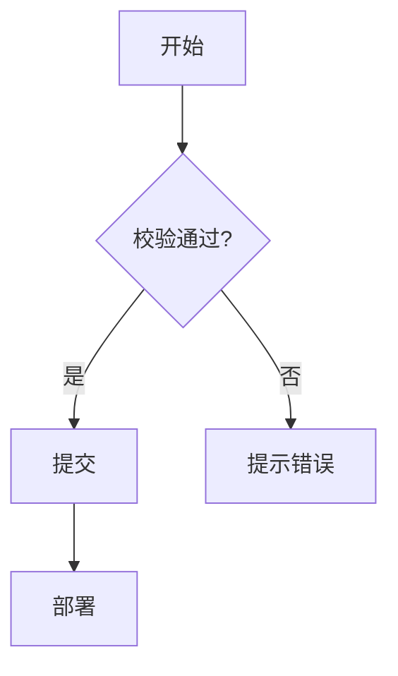
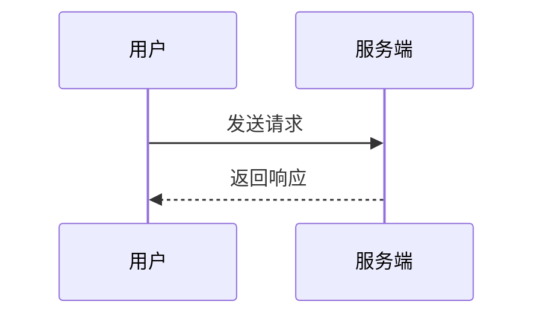

# Mermaid 预览演示

## 流程图（正常）

```mermaid
flowchart TD
    A[开始] --> B{校验通过?}
    B -->|是| C[提交]
    B -->|否| D[提示错误]
    C --> E[部署]
```

## 时序图（正常）

```mermaid
sequenceDiagram
    participant U as 用户
    participant S as 服务端
    U->>S: 发送请求
    S-->>U: 返回响应
```

## 错误语法（应显示错误并自动切换到源码视图）

```mermaid
flowchart TD
    A --> B
    this is invalid mermaid {{{
```
